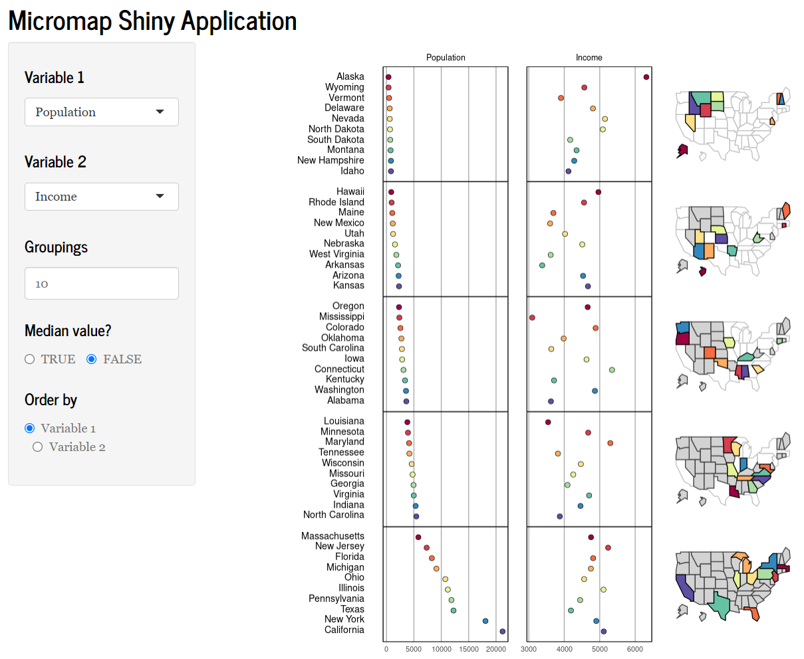

---
output:
  html_document:
    keep_md: yes
    toc: no
    self_contained: no
  pdf_document:
    toc: yes
---

### Micromap app

This repository contains materials for the R Shiny micromap application.  Click the screenshot below to visit the app.

### Screenshot

### License 

This package is released in the public domain under the creative commons license [CC0](https://tldrlegal.com/license/creative-commons-cc0-1.0-universal).